# Discount Roulette

This filter lets you build something like this:

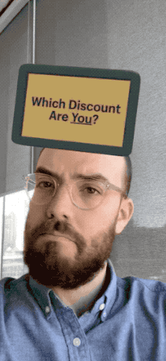

## Instructions

It's important that you familiarize yourself with Spark AR: https://blog.hootsuite.com/instagram-ar-filters/

Then open the `discount_roulette.arproj` file.

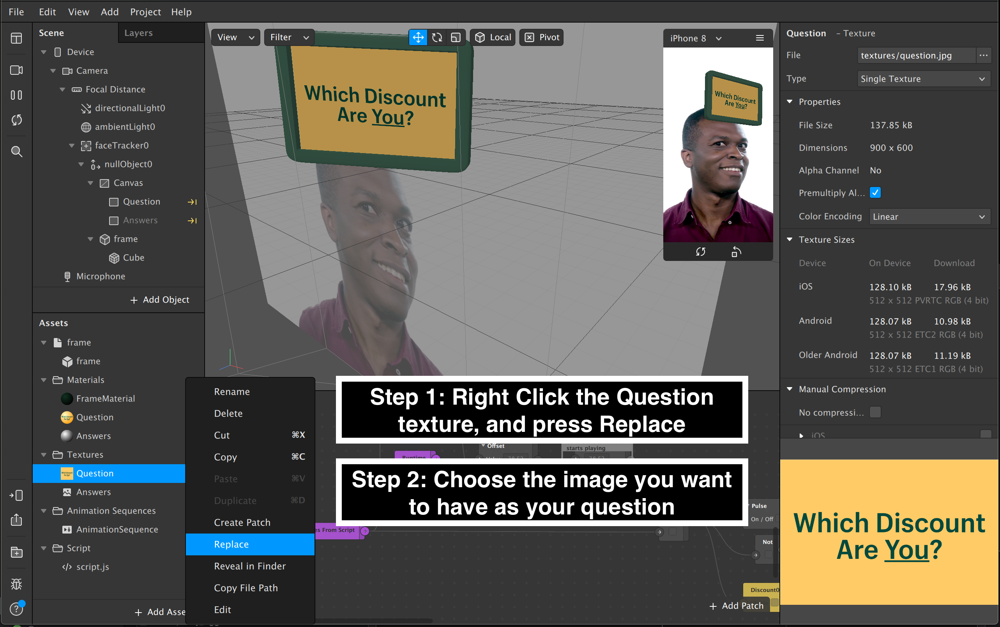
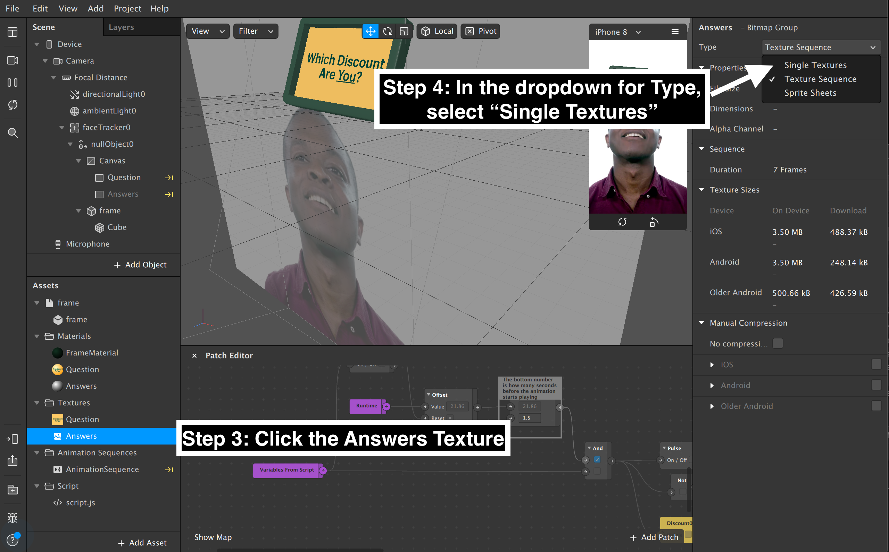
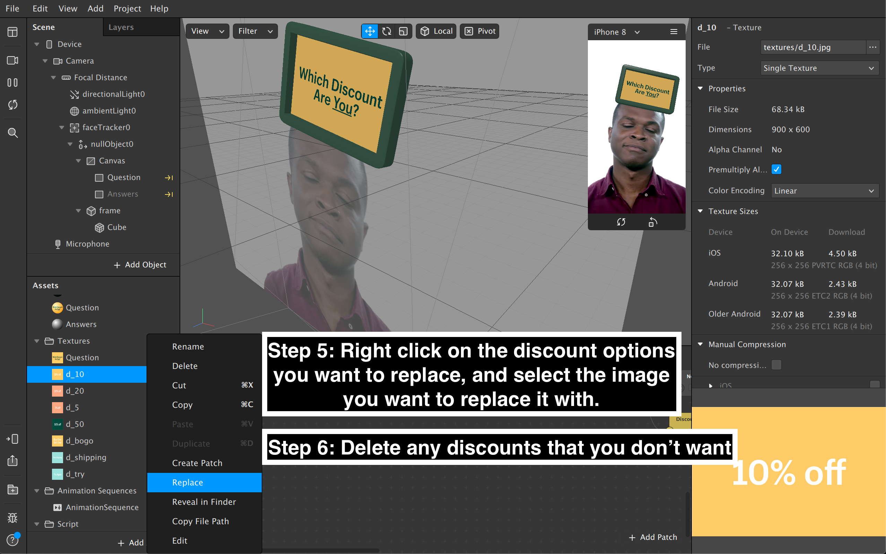
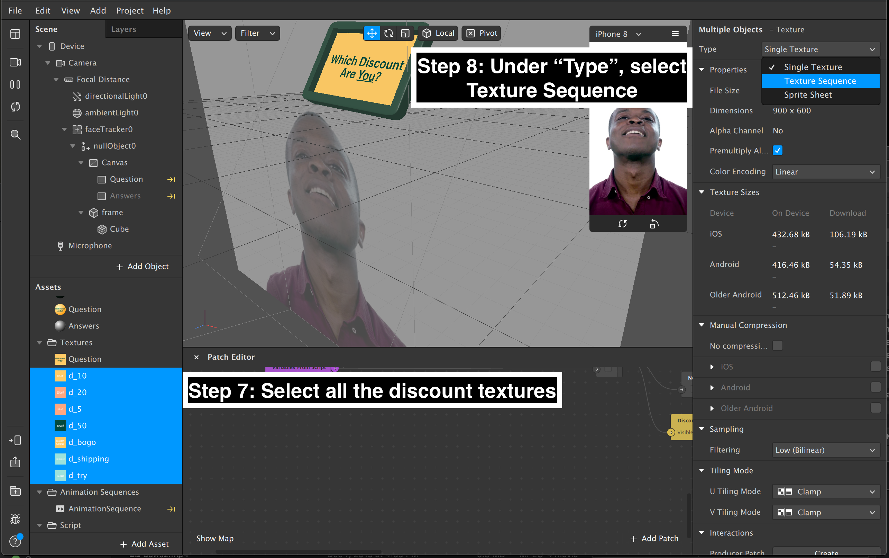
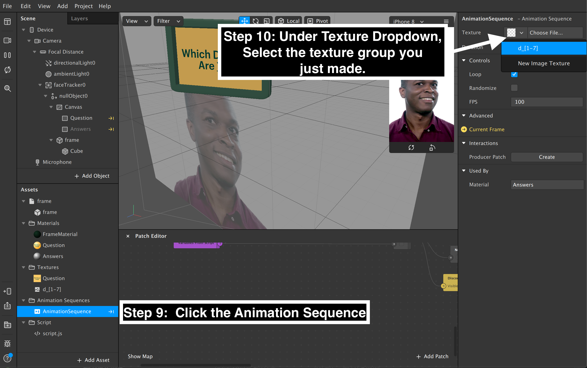
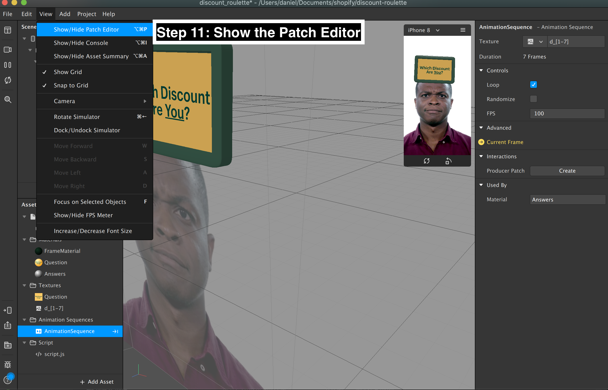
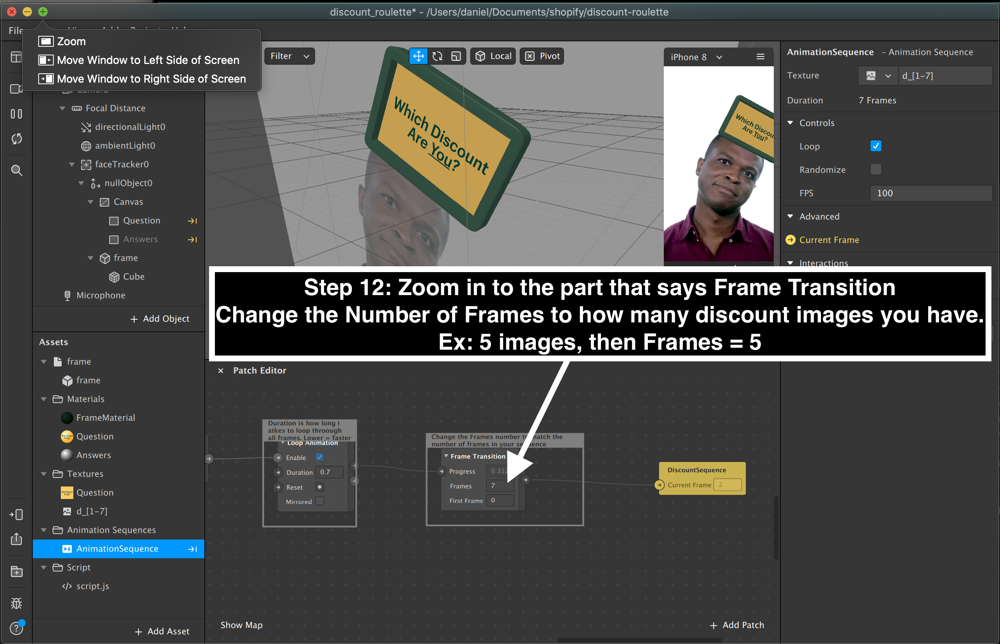
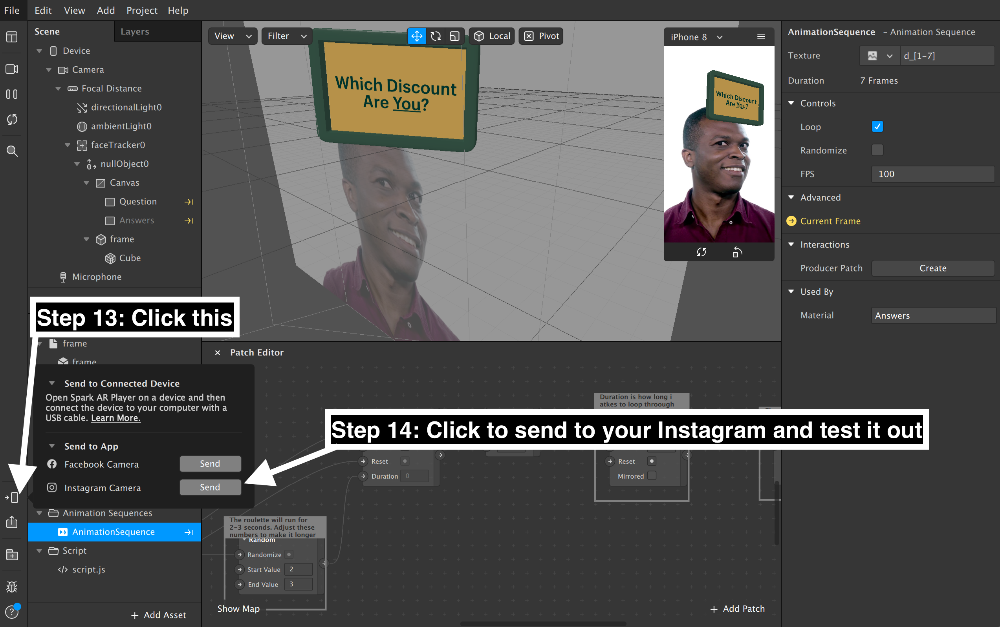

Note: The images only change once you're recording. Hold down the record button in Instagram and after 1.5 seconds you'll see it start.

## Other configurable settings: 
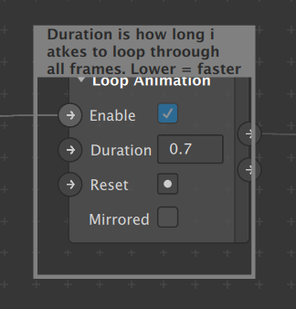  
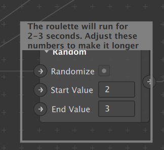  
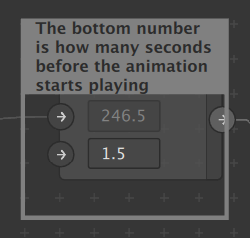 
